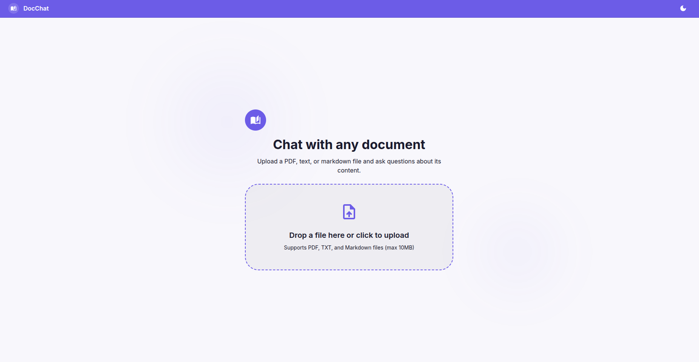
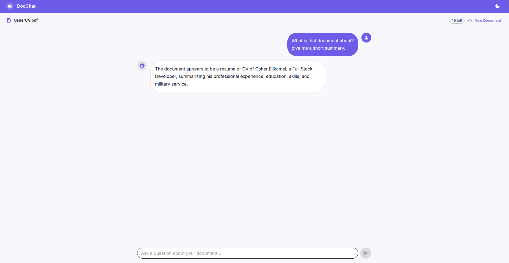
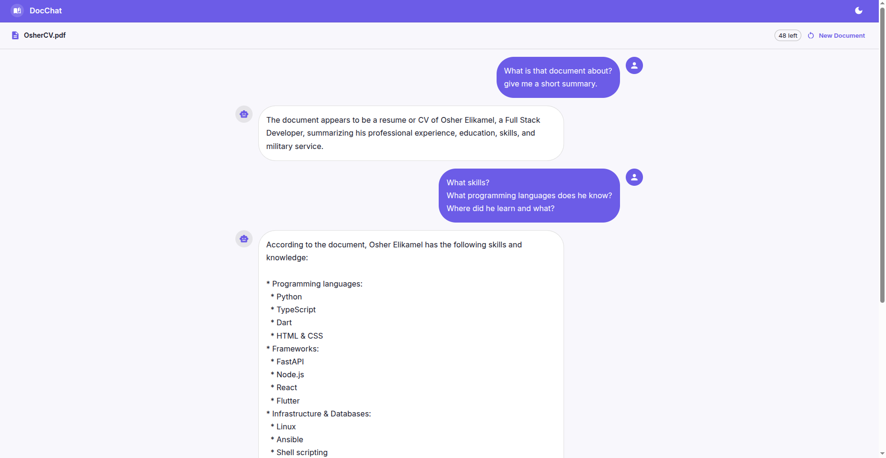

# DocChat

Upload a document and chat with its content using AI. Ask questions, get answers grounded in your document, with relevant quotes and context.



<details>
<summary>More screenshots</summary>

### Asking a Question


### Detailed Follow-Up


</details>

## How It Works

1. Upload a PDF, TXT, or Markdown file
2. The backend parses and chunks the document
3. Ask questions in the chat interface
4. Each question retrieves the most relevant chunks and sends them to Groq for a grounded answer
5. Sessions are capped at 50 messages to manage API usage

## Tech Stack

| Layer | Technology |
|-------|-----------|
| Frontend | React 19, TypeScript, Vite, MUI |
| Backend | Python, FastAPI |
| AI | Groq API (Llama 3.3 70B) |
| Document Parsing | pdfplumber |
| Dev Environment | Docker Compose |

## API Endpoints

| Method | Path | Description |
|--------|------|-------------|
| `GET` | `/api/health` | Health check |
| `POST` | `/api/upload` | Upload a document, returns session ID |
| `POST` | `/api/chat` | Send a question, get an AI answer |

## Quick Start

### With Docker Compose
```bash
cp backend/.env.example backend/.env   # add your GROQ_API_KEY
docker compose up
```
Then visit http://localhost:5173

### Manual Setup
```bash
# Backend
cd backend
cp .env.example .env   # add your GROQ_API_KEY
python -m venv venv
source venv/bin/activate
pip install -r requirements.txt
uvicorn app.main:app --reload

# Frontend (new terminal)
cd frontend
cp .env.example .env
npm install
npm run dev
```

## Environment Variables

### Backend (`backend/.env`)
| Variable | Description | Default |
|----------|-------------|---------|
| `GROQ_API_KEY` | Groq API key (required) | - |
| `ALLOWED_ORIGIN` | Frontend CORS origin | `http://localhost:5173` |
| `MAX_MESSAGES_PER_SESSION` | Rate limit per session | `50` |
| `MAX_UPLOAD_SIZE_MB` | Max file size | `10` |
| `GROQ_MODEL` | Groq model to use | `llama-3.3-70b-versatile` |

### Frontend (`frontend/.env`)
| Variable | Description | Default |
|----------|-------------|---------|
| `VITE_API_URL` | Backend URL | `http://localhost:8000` |

## Project Structure

```
├── backend/
│   └── app/
│       ├── main.py             # FastAPI app, CORS, health endpoint
│       ├── config.py           # Centralized env config
│       ├── routes/
│       │   ├── upload.py       # Document upload endpoint
│       │   └── chat.py         # Chat endpoint with rate limiting
│       └── services/
│           ├── document.py     # PDF parsing, chunking, storage
│           ├── session.py      # Session and rate limit management
│           └── chat.py         # Groq API integration, context retrieval
├── frontend/
│   └── src/
│       ├── pages/              # ChatPage
│       ├── components/ui/      # FileUpload, ChatMessage
│       ├── components/layout/  # AppShell
│       ├── services/           # API calls
│       ├── contexts/           # ThemeContext
│       ├── types/              # TypeScript interfaces
│       └── theme/              # MUI theme (light + dark)
└── docker-compose.yml
```
